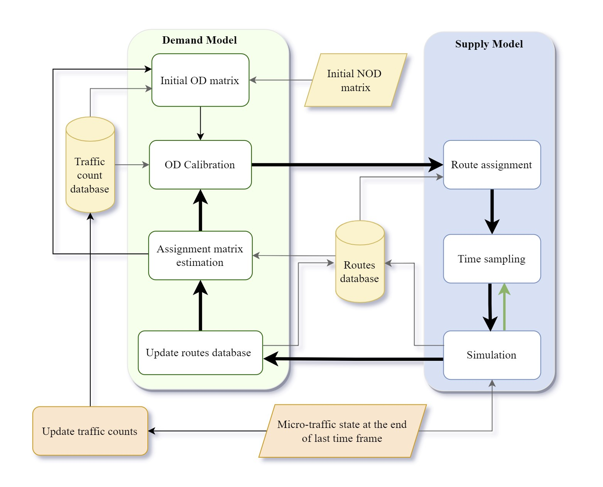

# Parallel Dynamic Calibration Tool for City-Scale Microscopic Traffic Simulation using [SUMO](https://sumo.dlr.de/index.html)

## Installation

To install and run the calibration tool, follow these steps:

1. Clone the repository to your local machine:

        git clone https://github.com/Khoshkhah/NRTCalib.git     

2. Install [SUMO](https://sumo.dlr.de/docs/Downloads.php).

3. Install the required dependencies. You can use pip to install them:
pip install -r requirements.txt

## Usage

The calibration tool has to be started via [calib.py](calib.py), which is a command line application. It has the necessary following parameters:

1. -n network file address, that is a sumo network file.

2. -m the measurment filename contains sensor data. 
        it is a table file contains three columns "edge", "count" and "interval" that are seperated by comma.

3. -dod the init distributed origin destination matrix filename.
        it is a table file contains five columns "from_node", "to_node", "interval","weight_trip" and "trip_id" that are seperated by comma.

4. -is the size of each interval in seconds. that is a integer number.

For more information of these input look at the sample grid in the [examples/grid](./examples/grid/) directory.

For getting the other optional arguments use the help command:

         python calib.py --help

Also for running the calibration tool, you can use a configuration xml file like [grid.cfg](./examples/grid/grid.cfg):

        python calib.py -c examples/grid/config.cfg

## High-level architecture of the calibration method for one frame

 

## Examples and Sample Data

We have provided examples and sample data in the [examples](./examples) directory. You can explore them to understand how to use the tool effectively.
All input data and a 24-hour calibrated microscopic traffic simulation for the case study of Tartu City is available at [zenodo.org](https://doi.org/10.5281/zenodo.8125656)

## Contact Information

For any questions, feedback, or inquiries, please feel free to reach out to us:
- Email: kaveh.khoshkhah(at)ut.ee

The calibration tool originates from an implementation of this paper [Leveraging IoT Data Stream for Near-Real-Time Calibration of City-Scale Microscopic Traffic Simulation](#). A preprint version of the paper can be downloaded at [link](https://arxiv.org/pdf/2210.17315.pdf).

